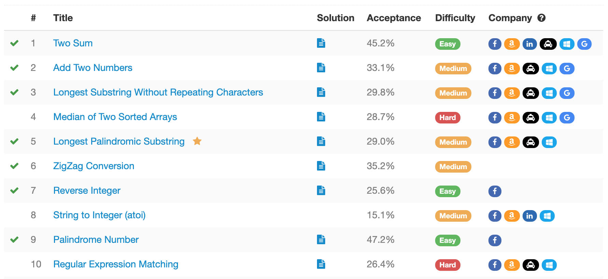

# LeetCode Plus

Google Chrome Extension which shows which LeetCode problems are associated with companies. All data used for this extension is sourced from information available in public domain. This Chrome extension supports following companies:

- Facebook
- Amazon
- LinkedIn
- Uber
- Microsoft
- Google

To Use:

1. Go to `chrome://extensions`
2. Select `Load Unpacked` and browse folder with this code (or drag and drop).
   - Must be in developer mode to use this extension (I did't want to publish it to the Chrome Web Store).
3. Go to `leetcode.com/problemset/all` (or any variation of `leetcode.com/problemset`).
4. Press the LeetCode Plus icon and Frequency column would be replaced by Company badges.
   - If you change pages, search problems, or filter problems, you must turn the extension off then on again (click the icon twice).

Data used for this extension can be found [here](https://github.com/xizhengszhang/Leetcode_company_frequency).